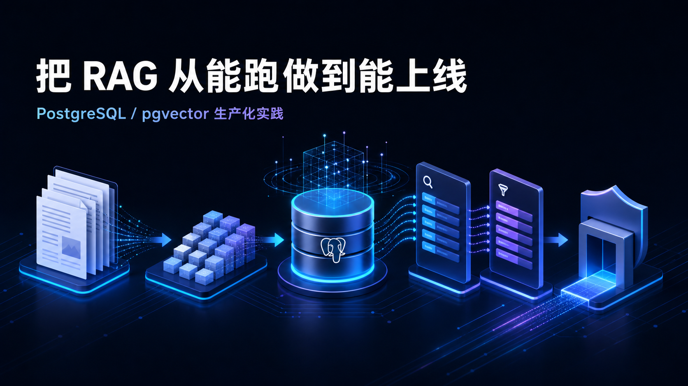
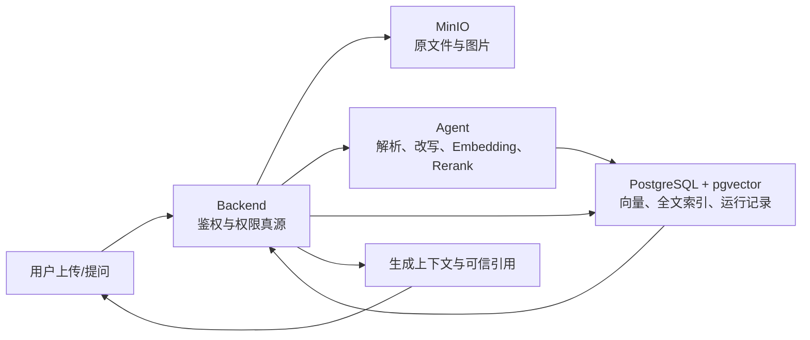

# 把 RAG 从“能跑”做到“能上线”：一套基于 PostgreSQL/pgvector 的生产化实践



> 摘要：一个真正可用的企业知识库，难点通常不在“调用一次 Embedding，再把 Top-K 塞给大模型”，而在数据质量、权限隔离、召回策略、失败降级和版本切换。本文复盘一套 RAG v2 的完整构造过程：从多格式文档解析，到混合召回、Rerank、父文档扩展，再到反馈闭环和影子索引灰度。
>
> 标签：`RAG` `pgvector` `PostgreSQL` `知识库` `大模型应用` `工程实践`
>
> 说明：文中的召回率和延迟数字是上线验收门槛，不是虚构的线上成绩；具体结果需要由业务评测集验证。

很多 RAG 教程的流程都很相似：读取文件、切块、生成向量、Top-K 检索，最后把内容交给大模型。

这个流程用来做 Demo 没问题，但一旦进入真实系统，问题会迅速变多：Word 里的表格和图片怎么办？扫描 PDF 怎么处理？切块命中了摘要却没命中答案怎么办？Embedding 服务挂了是不是整个问答也要挂？用户没有权限看的资料，会不会通过向量检索泄露？新索引效果不好，又该怎么无损回滚？

最近我把一个已有的 RAG 链路重新做了一次生产化改造。我们没有为了“架构看起来更高级”而引入新的向量数据库，而是保留 PostgreSQL/pgvector，把精力放在更影响最终效果的环节：数据、检索、安全和可运营性。

这篇文章不讲 RAG 的基础概念，重点讲这套链路为什么这样设计，以及哪些细节决定了它能不能真正上线。

## 一、先确定边界：不是所有事情都应该交给 Agent

这套系统分成四个核心部分：

- Backend：身份认证、资料权限、候选召回、引用校验的唯一真源。
- Agent：文档语义增强、Query Rewrite、Embedding、Rerank 和答案生成。
- PostgreSQL/pgvector：业务数据、向量、词法索引、处理记录和反馈数据。
- MinIO：原文件、规范 Markdown 和图片资产。

Redis 只承担非权限缓存，例如查询分析、Embedding 和 Rerank 结果。用户能看到哪些资料，不进入缓存，也不交给 Agent 自己判断。



这里最重要的原则是：**任何“用户可见资料范围”的判断，只能发生在 Backend 的 Repository 层。**

Agent 可以重排候选，却不能扩大候选范围；前端可以展示引用，却不能自己拼接对象存储地址。这样做看似保守，但它直接避免了最危险的一类问题：模型链路绕过业务权限。

## 二、为什么继续使用 PostgreSQL/pgvector

项目未来一年的资料量预计在一万份以内，原系统已经使用 PostgreSQL。这个规模下，单独引入 Milvus 会增加部署、备份、权限同步和数据一致性成本，却不一定带来决定性的收益。

因此我们保留了 1024 维 Embedding 和 pgvector，重点补齐三件事：

1. 把旧的向量索引升级为 HNSW。
2. 增加 PostgreSQL 全文检索和 `pg_trgm` 模糊匹配。
3. 使用版本化索引支持影子构建、灰度和回滚。

HNSW 的初始配置如下：

```sql
CREATE INDEX idx_chunk_vec_hnsw
ON material_chunks
USING hnsw (embedding vector_cosine_ops)
WITH (m = 16, ef_construction = 128);
```

查询时把 `hnsw.ef_search` 设置为 100；在 pgvector 0.8 及以上版本启用 iterative scan，减少权限过滤之后候选数量不足的问题。

这个选择背后的思路很简单：**在规模没有证明现有数据库撑不住之前，不要提前支付分布式系统的复杂度。**

## 三、文档入库不是一个函数，而是一条可恢复流水线

我们把 Parser 拆成七个可追踪阶段：

```text
extract → clean → enrich → assets/OCR → chunk → embed → persist
```

每次处理都会记录资料 ID、解析代次、索引版本、当前阶段、耗时和错误。这样即使中途失败，也能知道失败发生在哪一步，而不是只留下一个模糊的“解析失败”。

### 1. 上传时就阻断脏输入

Backend 对文件做三层校验：扩展名、MIME 和文件签名。目前支持 TXT、Markdown、DOCX 和 PDF，单文件上限为 50 MiB。

例如，文件名是 `.pdf`，但内容没有 `%PDF-` 文件头，会被直接拒绝；DOCX 除了 ZIP 签名，还要确认包内存在 `word/document.xml` 和 `[Content_Types].xml`。

更关键的是，团队写权限必须在读取完整文件、写入 MinIO 之前完成。否则一个没有权限的用户，也能不断制造大文件上传和孤儿对象。

### 2. 原文件和规范版同时保留

原文件写入 MinIO 的 source bucket，解析后再生成规范 Markdown 写入 derived bucket。

原文件用于审计和下载，规范 Markdown 用于检索和在线阅读。两者不能互相替代：只保留原件不利于统一处理，只保留清洗结果又会丢失可追溯性。

DOCX 解析时按文档节点顺序保留段落和表格；PDF 保留页码、文本和表格。低文本密度页面会被识别为扫描页，渲染成图片进入 OCR 流程。图片使用 SHA-256 去重，避免同一张 Logo 或截图被反复存储。

### 3. 清洗规则必须版本化

页面 ID、时间戳、编辑历史、浏览器兼容提示、论坛回复标记和纯数字噪声，都会干扰检索。

这些规则没有写死在解析函数里，而是放在版本化配置中。每次处理除了保存清洗后的正文，还会记录每条规则删除了多少内容以及少量抽样结果。这样后续发现误删时，可以定位到具体规则和版本。

### 4. 云调用前脱敏，图片默认 fail-closed

发送给云模型的文本会遮蔽 Bearer Token、API Key、AWS Key、密码、邮箱和手机号；本地原文不被修改，仍然由业务权限控制。

图片更麻烦，因为想识别图片中的秘密，通常需要先做 OCR，而 OCR 本身可能就是云服务。我们的默认策略是禁止把原始图片发送到远端视觉模型。只有资料已确认不敏感，或者视觉端点位于受控内网时，才显式开启原图处理。

这会牺牲一部分“开箱即用”的图片理解能力，但安全策略应该默认失败关闭，而不是默认把未知内容上传出去。

## 四、摘要不是正文前缀，而是一种独立检索信号

每份资料会生成三类语义元数据：

- 一句话摘要；
- 5～8 个技术关键词；
- 3～5 个“这份资料能回答的问题”。

我们没有把摘要重复拼到每一个正文块前面。这样虽然能让每块看起来都有“全文背景”，却会让摘要的泛化语义长期占据 Top-K，真正包含参数、命令或表格的正文反而被挤出去。

更合理的做法是，把不同内容作为不同的检索信号保存：

```text
body      正文块
summary   全文摘要
question  候选问题
image     图片 OCR 与说明
```

检索阶段可以命中任意信号，但在构造最终上下文时，再回到对应父资料的正文。这样既利用了摘要和候选问题的召回能力，又不会让它们替代真正的证据。

## 五、分块策略：短文档保持完整，长文档结构化切分

统一固定长度切块实现简单，但并不适合所有资料。

当前策略是：

- 不超过 5000 字且不超过 3500 Token 的短文档，整篇入库。
- 长文档按标题、段落和表格递归组合，每块最多 3000 Token。
- 相邻块保留 300 Token 重叠。
- 每块保存标题路径、页码和 Token 数。

短文档整篇入库的价值在于保留完整语义；长文档则需要控制上下文成本，并为“同章节扩展”和“前后块扩展”留下结构信息。

分块参数也不是永恒常量。索引版本表会记录模型、维度、Parser 版本和分块配置，任何策略变化都构建新索引，而不是悄悄覆盖线上数据。

## 六、检索链路：混合召回比单纯向量 Top-K 更稳

一次问答的检索过程如下：

### 1. 只改写真正依赖上下文的问题

Backend 先验证会话属于当前用户，再读取最近 20 条消息。

Agent 只对“它怎么配置”“前面那个参数是什么”这类指代性追问做 Query Rewrite。一个本来就完整的问题，不需要为了使用模型而强行改写。

改写后的问题只用于检索，生成端仍回答用户的原始问题。前端会展示“已理解为……”，让用户知道系统如何解释了这次追问。

### 2. 向量和词法各取 Top-30

向量召回解决语义相近但字面不同的问题；全文检索和 Trigram 则擅长型号、命令、配置项和专有名词。

两路结果使用 RRF（Reciprocal Rank Fusion）融合：

```text
RRF(d) = Σ 1 / (60 + rank_i(d))
```

RRF 不要求向量分数和词法分数处于同一量纲，只关心文档在各自结果中的排名，非常适合融合异构检索器。两路各取 30 条，融合后保留 20 条候选。

如果 Embedding 调用失败，系统仍然继续执行词法召回。这里还有一个容易忽略的细节：中文关键词不能简单拼成一个 `plainto_tsquery`，否则多个词会变成过严的 AND 条件。实现中把改写问题和技术关键词作为独立 term，以 OR 语义参与全文、Trigram 和 `ILIKE` 匹配。

### 3. Rerank 只处理 20 条候选

融合后的候选交给 `qwen3-rerank`，最终保留 Top-8。

Rerank 的超时预算是 1.2 秒。超时、密钥缺失或响应异常时，不让整条问答失败，而是回退到 RRF 顺序。缓存键包含模型、查询、Top-N 和候选内容哈希，既避免陈旧结果，也不缓存任何权限集合。

### 4. 命中子块后，重新扩展父资料

真正送给生成模型的不是孤立的 Top-8 信号，而是经过父资料扩展后的正文：

- 短资料召回完整正文；
- 长资料取命中块、同章节块和前后相邻块；
- 最多 3 份资料、8 个正文块、12k Token。

如果命中的是摘要、候选问题或图片说明，就把它当成“父资料命中”，再回到正文寻找证据。

这一步解决的是 RAG 中很常见的矛盾：检索需要小而精确的信号，生成却需要连续、完整的上下文。

## 七、权限校验必须出现不止一次

很多系统只在第一次召回时做权限过滤，然后默认后续处理都可信。这还不够。

我们的链路会在三个位置重新验证：

1. 向量和词法候选必须来自 `VisibleMaterialsScope`。
2. 父资料扩展再次应用同一个可见性范围，不能只相信第一阶段返回的 material ID。
3. 返回引用之前，Backend 校验 material、chunk 和 asset ID，并且只允许引用实际送入生成上下文的块。

这意味着即使 Agent 返回了一个伪造或过期的 chunk ID，前端也拿不到越权引用。

同样，Redis 不缓存“这个用户能看到哪些资料”，对象存储也不返回永久公开 URL。Backend 在鉴权后生成短时效签名地址，并区分容器内部连接端点和浏览器可访问端点，避免把 `minio:9000` 这种内部主机名发给用户浏览器。

## 八、生产链路必须允许局部失败

生产 RAG 不应该是一个“任何一步失败，整个请求报错”的串行脚本。

这套链路定义了固定降级顺序：

```text
Query Rewrite 失败 → 使用原问题
Embedding 失败     → 仅词法召回
Rerank 失败        → 保留 RRF 顺序
OCR 失败           → 只展示图片
没有可靠候选       → 明确回答“当前知识库未找到依据”
```

阶段预算大致为 Rewrite 800ms、Embedding 700ms、数据库召回 300ms、Rerank 1200ms，总检索目标 P95 不超过 2.5 秒。

Redis 的连接和读写也设置了很短的 socket timeout。缓存不可用只会降低性能，不能拖死问答请求。

这里的核心思想是：**降级不是异常处理里的临时补丁，而是 RAG 产品行为的一部分。**

## 九、评测、反馈和可观测性要在上线前接好

如果没有评测集，调整 Top-K、Rerank 数量和分块参数，本质上都只能靠感觉。

我们先要求至少 100 条人工标注问题，生产前扩展到 300 条。每条问题标注正确答案应该来自哪些资料，离线输出：

- Recall@5、Recall@20；
- MRR；
- NDCG@5；
- Rerank 后 Recall@5；
- 检索 P95 延迟。

当前上线门槛设置为 Recall@20 ≥ 95%、Rerank 后 Recall@5 ≥ 90%、检索 P95 ≤ 2.5 秒。评测过程中如果 Rerank 实际发生降级，任务会直接失败，不能把 RRF 回退结果伪装成模型重排成绩。

线上则记录每次 RAG 运行的原始问题、改写问题、索引版本、阶段耗时、降级阶段和候选分数。点赞、点踩和原因单独入库，并关联到具体回答。

Prometheus 重点关注各阶段 P95/P99、空召回率、降级次数、点踩率和解析失败率。日志只记录 trace、模型和版本，不记录原始正文。

这些数据的价值甚至高于某一次模型升级，因为它们会不断产生真实 Bad Case。

## 十、不要在原索引上原地重建

RAG 的数据结构和检索参数变化很多，如果每次升级都直接覆盖线上索引，回滚会非常痛苦。

因此我们为每个 chunk 增加 `index_version`，旧索引标记为 `legacy-v1`，新索引写入 `rag-v2`。唯一约束也包含版本：

```sql
CREATE UNIQUE INDEX uq_material_chunks_version_kind_idx
ON material_chunks(material_id, index_version, kind, chunk_idx);
```

新版本先作为影子索引在后台完整构建，线上继续读取旧版本。通过同一套人工评测后，再按 material ID 的稳定哈希 cohort 执行 10% → 50% → 100% 灰度。

每个比例都可以重复执行，也可以从 50% 缩回 10%。异常时，存在 legacy 数据的资料立即切回；新上传、只有 v2 数据的资料仍然保持可用。旧索引保留 14 天，确认稳定后再清理。

这套做法的好处是，RAG 升级终于从“跑一段脚本然后祈祷”，变成了一个可观察、可回退的发布过程。

## 十一、这次改造带来的几个结论

回头看，最值得保留的不是某一个模型或参数，而是下面这些工程判断：

第一，**数据处理决定了 RAG 效果的上限。** 如果解析顺序错了、噪声没清掉、摘要污染正文块，再好的生成模型也只能在错误证据上发挥。

第二，**检索和生成需要不同粒度的上下文。** 小块、摘要、候选问题适合召回；连续正文和父资料适合生成。不要强迫一个数据结构同时把两件事做到最好。

第三，**权限是检索条件，不是生成提示词。** “请不要泄露无权限资料”不能替代数据库中的强制过滤。

第四，**所有外部依赖都要有超时和降级。** Embedding、Rerank、OCR、Redis、MinIO 任何一个都会失败，生产链路必须提前定义失败后的产品行为。

第五，**RAG 本质上是一个持续运营的数据系统。** 没有评测集、运行明细和用户反馈，就没有可靠的迭代依据。

一个 RAG Demo，可能几百行代码就能跑起来；一个能上线的 RAG，需要处理数据版本、权限、降级、追踪、评测和回滚。

真正拉开差距的，通常不是“用了哪个框架”，而是有没有把这些看起来不够性感、却决定系统可靠性的细节做完整。
